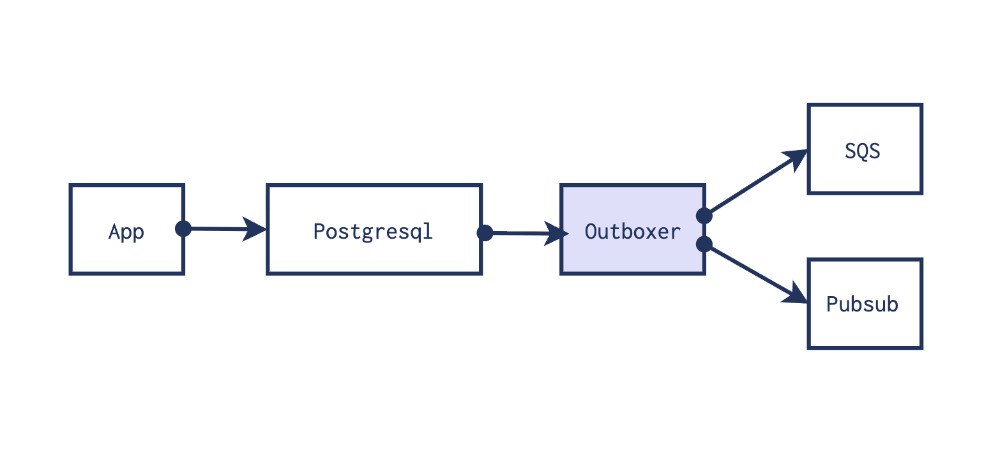

<p align="center">
  
</p>

# Outboxer

[](https://github.com/fvdsn/outboxer/actions/workflows/ci.yml)
[](https://goreportcard.com/report/github.com/fvdsn/outboxer)
[](LICENSE)

Outboxer is a standalone worker application that reads events from a postgresql
database and sends them to AWS SQS or GCP Pubsub using the outbox pattern.

Outboxer is battle tested, high throughput, low latency, easy to operate, and 
integrates nicely with the GCP and AWS platform.

All event properties and options of SQS and Pubsub are supported. Ordering of the
event is kept, and at least once delivery is guaranteed.

Outboxer is best deployed as a Kubernetes component, a GCP Cloudrun, or an AWS ECS
instance. It is configurable with environment variables. It is implemented in go and
published as a small docker image.

```text
ghcr.io/fvdsn/outboxer:latest
```


